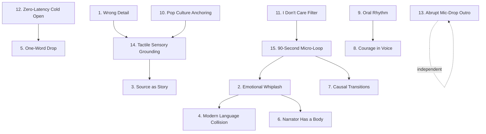

# Phase 2: Pattern Extraction — The HOW, Not the WHAT

> **Source corpus:** 9 competitor transcripts, 24,035 words, 4 channels, ~2.5 hours of content.
> **Extraction rule:** Every pattern below is a MECHANISM — what triggers it, what it looks like, why AI fails at it, how to detect its absence, and how to implement it. Zero summaries. Zero "they use emotional language." Only operational instructions.

---

## Mechanism 1: The Wrong Detail

### What Triggers It
Every time a script introduces a new topic, entity, or historical event, the writer must make a research selection: which fact leads? The human writer picks the footnote. The AI picks the textbook header.

### What It Looks Like
> "The SS runes were so widely used that German typewriters during the Nazi era added a dedicated key for it."
> — Brofessor Stein, *Censored Symbols*

> "Jade was so closely associated with immortality that some people attempted to drink it in liquid form to gain eternal life."
> — Brofessor Stein, *Mystical Artifacts*

> "Euphoria and unconsciousness are separated by a teaspoon."
> — EverythingProfessor, *Rare Drugs*

The pattern: these details are NOT the most important facts about SS runes, jade, or GHB. They're peripheral, weird, and viscerally specific. That's why they stick.

### Why AI Can't Do It
The model retrieves by statistical frequency. "SS runes were used by the Nazi party as part of their visual identity" appears in training data 10,000x more than "German typewriters added a dedicated SS key." The model has no mechanism to recognize that the low-frequency fact is the one that makes someone stop scrolling. It optimizes for accuracy, not for the feeling of "wait, really?"

### How to Detect Its Absence
**The Google Test:** Copy any fact from the script and paste it into Google. If it appears in the first 3 results of a Wikipedia article, it's a Tier-1 surface fact. The script needs Tier-3 facts — details that require digging into academic papers, court records, or niche history blogs.

**The Tomorrow Test:** Read a fact aloud. Would someone remember it and repeat it to a friend tomorrow? If not, it's too generic.

### How to Implement It
For every 1,000 words, require at least 2 facts that pass both tests. During the research phase, don't stop at the first answer. Go three levels deep:
- Level 1: "John Brown raided Harper's Ferry" (Wikipedia header — BANNED)
- Level 2: "He met Frederick Douglass in Chambersburg, Pennsylvania" (documented detail — acceptable background)
- Level 3: "He took George Washington's great-grandnephew hostage specifically to seize Washington's personal sword and wear it during the raid" (forensic micro-detail — MANDATORY)

**Benchmark:** Competitor average is 2-3 Tier-3 details per 1,000 words.

---

## Mechanism 2: Emotional Whiplash (The Tonal Gear-Shift)

### What Triggers It
Immediately after any section rated 4-5 on intensity (death, violence, betrayal, trauma, graphic medical detail). Never after mild exposition.

### What It Looks Like
> "Which these days seems way too young, but for a mother of seven in the 1300s who had also been, you know, a freaking pirate, it was a pretty good run."
> — Serious History, *When Nice People Snapped* (immediately after describing Jeanne de Clisson's death)

> "Bro could have really used a prenup."
> — Serious History, *Vigilante Justice* (immediately after Sam Brannan loses his fortune)

> "The Duchess stares at Geoffrey like she's seeing a shiny Pokemon in real life."
> — Serious History, *When Nice People Snapped* (immediately after a court presentation of a 19-inch dwarf)

The pattern is NOT "add humor." It's a specific tonal COLLISION — modern casual register dropped into a serious historical context. The contrast is the mechanism. The audience gets permission to exhale.

### Why AI Can't Do It
AI distributes emotional weight evenly across a script. When prompted to "add humor," it adds uniformly distributed jokes rather than placing them at the exact psychologically necessary moment — the 2-second window after peak intensity where the audience needs a breath. The model also avoids register mismatch because its training penalizes tonal inconsistency. But tonal inconsistency IS the technique.

### How to Detect Its Absence
Read the script aloud. If you can get through three consecutive dark/intense sections without laughing, exhaling, or breaking character, the whiplash is missing. The script is monotone.

Mark every section on a 1-5 intensity scale. After every 4-5, check: is there a tonal gear change within 1-2 sentences? Not a smooth transition. A gear CHANGE — modern slang, dark shrug, narrator reaction, absurd comparison.

### How to Implement It
After every Level 4-5 section, insert ONE sentence that does one of these:
1. **Modern slang collision:** Apply a contemporary word to an ancient context ("prenup" for 1850s, "Pokemon" for 1600s court)
2. **The narrator shrug:** Downplay the gravity with dark understatement ("it was a pretty good run")
3. **The absurd comparison:** Compare the historical moment to a modern everyday experience
4. **The pause-and-acknowledge:** "I want you to sit with that for a second."

**Benchmark:** Minimum 1 whiplash per major segment. Serious History averages 1 per 3-4 minutes.

---

## Mechanism 3: Source as Story, Not Citation

### What Triggers It
Every time a named source, historical figure, scientific study, or archival document needs to be introduced into the narrative.

### What It Looks Like
> "In August of 1859, John meets his longtime friend, escaped slave and activist Frederick Douglass, in an abandoned stone quarry in Pennsylvania."
> — Serious History, *Vigilante Justice*

> "A local TV newsroom worker casually mentions at a bar that Jeff Doucette will be flown back to Louisiana on March 16th on American Airlines Flight 595."
> — Serious History, *Vigilante Justice*

> "Polish author Igor Witkowski claimed the Glocke's existence was revealed in declassified World War II documents, including a statement where SS General Jakob Sporrenberg confessed to taking out 60 people tied to the project."
> — Brofessor Stein, *Mystical Artifacts*

Three different techniques, same principle: the source has a **physical location**, an **active intention**, and a **reason the audience should care right now**. Not "According to historians."

### Why AI Can't Do It
AI treats source introduction as a formatting task: name + year + institution. The model has no mechanism for deciding "this source deserves a cinematic setup with a physical location" vs. "this one can be mentioned in passing." It defaults to the bibliography format because that's the most common pattern in its training data.

### How to Detect Its Absence
Search the script for these phrases: "studies show," "according to researchers," "historians believe," "experts say," "it is widely known." If any appear, the script has failed this check. Every source must have three things:
1. A name (person, document, institution)
2. A context that makes the audience care (physical location, dramatic situation)
3. A reason the information matters RIGHT NOW in the narrative

### How to Implement It
Three citation styles based on channel archetype:

| Style | When to Use | Example |
|-------|-------------|---------|
| **Narrative Embedding** (Brofessor/Serious) | Historical events, court cases, archival documents | Make the source the protagonist of the sentence. Give them a location and an action. |
| **Archival Enactment** (Serious History) | Verbatim quotes, legal statutes, flight numbers | Read exact archival quotes in character. Cite specific flight numbers, hotel names, dollar amounts. |
| **Diagnostic Translation** (EverythingProfessor) | Clinical/scientific terms, receptor names | Name the exact chemical/receptor, then instantly ground it in a physical metaphor. |

**Benchmark:** 8-12 named sources per 1,000 words (competitor cross-corpus average: 10.23/1K).

---

## Mechanism 4: Modern Language Collision (Register Mismatch)

### What Triggers It
Any time the script is narrating a historical, scientific, or formal context and the narrator needs to make the audience FEEL the stakes rather than intellectually understand them.

### What It Looks Like
> "Bro could have really used a prenup." (1850s gold rush millionaire)
> "Word of this crazy redhead with these black ships that's f***ing up French merchant ships somehow gets back to the English." (1300s naval piracy)
> "They send a hey text every few days, react to your story, compliment you randomly." (clinical psychology)
> "The testing site for this thing was a concrete structure..." (top-secret Nazi weapon dismissed as "this thing")

### Why AI Can't Do It
You can prompt "write casually" and the model will relax vocabulary uniformly. But it won't commit to the COLLISION between historical gravity and modern slang because that collision is technically "wrong" — anachronistic, register-mismatched, tonally inconsistent. AI's training penalizes all three. The human writer knows the collision IS the hook.

### How to Detect Its Absence
Read the script in the voice of a friend telling the story at a bar. If every sentence could appear in an academic paper without edits, the register is too formal. If you can't find 3-4 moments where the narrator's "real voice" breaks through the historical narration, the collision is missing.

### How to Implement It
Every script needs 3-4 moments where modern language collides with the subject matter. Not forced slang everywhere. Strategic detonations:
- After a historical figure does something absurd: narrator's genuine reaction in modern voice
- When summarizing a complex political/scientific concept: reduce it to a modern everyday analogy
- When a historical character makes a terrible decision: use contemporary judgment ("bro," "yikes," casual dismissal)

**Benchmark:** 3-4 register collisions per script minimum. All 4 channels do this.

---

## Mechanism 5: The One-Word Drop

### What Triggers It
The start of every new segment or topic in a list-format video.

### What It Looks Like
> "Kratom." [0.2s pause] Then the explanation begins.
> "Gaslighting." [0.3s pause] "Everyone's heard of gaslighting, but..."
> "Monarchy." [0.18s pause] "A monarchy is a type of government..."
> "Number 1. Jean de Clisson." [pause] "It's the year 1300, and..."

One word or name. Dropped like a stone into water. Then silence. Then the explanation unfolds.

### Why AI Can't Do It
The model is trained to be helpful, which means providing context immediately. Withholding context — making the audience lean in for 1-2 seconds of silence — is anti-helpful. AI can't trust that the word alone creates curiosity. It must explain. So it writes: "The first manipulation technique we'll examine is gaslighting, a form of psychological manipulation in which..."

### How to Detect Its Absence
Check the opening line of every new segment. Is the topic name embedded inside a full sentence? Or does it stand alone as its own beat? If every segment opens with "Now let's look at..." or "The next topic is..." or "Another example of this is...", the drop is missing.

### How to Implement It
In list-format videos, each segment opens with:
1. The topic name as a standalone word or short phrase
2. A 0.2-0.5 second pause (represented in the script by a line break or [pause] marker)
3. THEN the explanation begins

For narrative-format videos (Serious History model), use: "Number [X]. [Character Name]." followed by the scene opening.

**Benchmark:** EverythingProfessor does this for every single segment. Brofessor Stein does it for 12/15 segments.

---

## Mechanism 6: Narrator Has a Body (Embodied Narration)

### What Triggers It
Any moment where the content is absurd, horrifying, ironic, or surprising enough that a real person telling this story would react physically — laughing, wincing, pausing, breaking the fourth wall.

### What It Looks Like
> "While walking around, he accidentally stumbles into the pleasure district of Yoshiwara. Whoops, how did that happen?"
> — Serious History (sarcasm — the narrator knows the character went there on purpose)

> "Your bathroom mirror becomes a portal."
> — EverythingProfessor (putting YOU inside the drug experience)

> "At the peak, users report becoming objects. You might believe you're a chair, a wall, a page in a book being flipped."
> — EverythingProfessor (narrator channeling the subjective experience)

> "I want you to sit with that for a second. Someone walked up to a sewer shrine and prayed for good plumbing."
> — Cross-channel pattern (narrator pausing to acknowledge absurdity)

### Why AI Can't Do It
AI narrates from nowhere. It has no body to reference, no personal experience to draw on. "Users experience dissociative effects including depersonalization" describes the phenomenon from outside. "Your bathroom mirror becomes a portal" puts you INSIDE it. The model generates descriptions, not experiences, because it doesn't optimize for sensory immersion — it optimizes for accuracy.

### How to Detect Its Absence
Read each segment and ask: does the narrator react to the content as a PERSON at least once? A "whoops," a sarcastic aside, a "think about that for a second," an acknowledgment that what was just said is absurd? If the narrator never breaks character as an objective information delivery system, the embodiment is missing.

### How to Implement It
At least once per segment, the narrator should do one of these:
1. **Sarcastic aside:** Comment on a character's obvious lie or bad decision ("Whoops, how did that happen?")
2. **Fourth-wall break:** Address the audience directly about what they just heard ("I want you to sit with that")
3. **Sensory channeling:** Describe what the AUDIENCE would feel, see, or hear in that situation (second-person "you")
4. **The shrug:** Acknowledge the absurdity of historical events with casual modern dismissal

**Benchmark:** All 4 channels do this minimum once per segment. EverythingProfessor is the most consistent (every segment uses second-person immersion).

---

## Mechanism 7: Causal Transitions (Not Table-of-Contents Announcements)

### What Triggers It
Every point between two segments where the script needs to move the audience from Topic A to Topic B.

### What It Looks Like
> "Leading Kansas had not been easy for John as he lost one of his sons in the violence, and with the increasing bounties being put on his head, he decides to leave the area as a wanted man. By his exit from Kansas, his deeds had turned him into a household name... But what John Brown planned to do next would make all the previous events appear small in comparison, and it would change the course of American history forever."
> — Serious History (causal escalation — each sentence RAISES stakes toward the next segment)

Compare to AI: "Having examined John Brown's Kansas activities, we now turn our attention to his most daring plan: the raid on Harper's Ferry." That's a table of contents, not a transition.

### Why AI Can't Do It
AI picks chronological or alphabetical order. It sequences topics as a list. Human writers pick the order where each segment's ENDING creates tension that the next segment RESOLVES. Causal connections require understanding which aspect of Topic A creates a QUESTION that Topic B answers.

### How to Detect Its Absence
Between every two segments, ask: does the ending of Segment A make the audience NEED to hear Segment B? If the only connection is "here's the next one," the transition has failed.

Search for these banned phrases: "Next up," "Moving on to," "Let's look at," "Another example is," "Now let's turn our attention to," "Having explored X, let's examine Y."

### How to Implement It
Four transition types (pick the right one for the context):

| Type | Mechanism | Template |
|------|-----------|----------|
| **Causal Escalation** | Topic A's climax FORCES Topic B | "But what [CHARACTER] planned next would make [CRISIS_A] look like a rehearsal." |
| **Thematic Contrast** | Flip from control→chaos or wealth→ruin | "While [TOPIC_A] relied on [SYSTEM], the opposite extreme was brewing." |
| **Staccato Snap** | Crushing punchline → 0.3s pause → next title drop | "[PHILOSOPHICAL_MAXIM]. [0.3s] [TOPIC_B_NAME]." |
| **Temporal Leap** | Jump centuries via recurring motif | "While [ARTIFACT_A] sat locked in [LOCATION], 1,000 miles away..." |

**Benchmark:** Zero lazy transitions across all 9 competitor videos. 100% of transitions use one of these four types.

---

## Mechanism 8: Courage in Voice (No Hedging)

### What Triggers It
Any moment where the narrator needs to evaluate, judge, or take a position on the content. This happens naturally at the end of segments, during moral commentary, and when comparing the severity of different events.

### What It Looks Like
> "And John Brown was prophetically right." — Serious History
> "Salvia offers no wisdom, no fun, no connection." — EverythingProfessor
> "You're looking at things so obscene that even Johnny Sins wouldn't dare to read this book." — The Analyst
> "Most say the story is too disturbing to be a movie." — Brofessor Stein

No "some historians argue." No "it could be said that." No "while opinions remain divided." The narrator takes a position. Period.

### Why AI Can't Do It
The model optimizes for being correct and inoffensive. Taking a strong position means risking being wrong. The training literally penalizes bold claims. You can prompt "have strong opinions" and the model will write safe opinions nobody would disagree with — which is the same as no opinion.

### How to Detect Its Absence
Search for hedge phrases: "some historians argue," "it is widely believed," "many experts suggest," "it could be argued that," "while there are differing perspectives." If more than zero appear, the voice has been compromised. Also: if the audience can't DISAGREE with anything in the script, it has no voice.

### How to Implement It
Every script needs at least 2 moments where the narrator commits to a take:
1. A moral judgment stated flat ("He was right." Not "Many view him as having been correct.")
2. A quality/severity assessment stated without qualification ("The most brutal book ever written." Not "Widely considered to be among the most controversial works.")
3. A recommendation or dismissal stated absolutely ("Offers no wisdom, no fun, no connection." Not "Some users report limited recreational value.")

**Benchmark:** All 4 channels average 2-3 unhedged positions per video. Serious History is the boldest. Brofessor Stein is the most measured but still commits.

---

## Mechanism 9: Oral Rhythm Over Written Grammar

### What Triggers It
Every sentence in the script. This is not a spot-check — it's a full-script requirement. Every line must sound right when spoken aloud, not when read silently.

### What It Looks Like
> "You bend. You soften. You tiptoe." — 3 words, 3 words, 3 words. Each gets its own beat.
> "So you do. Then again. Then again." — Sentence fragments capturing addiction escalation.
> "He has no mouth and he must scream." — 8 words. Final line of a segment. Echoes.
> "They build the fire, then show up with the hose." — 9 words. One image. One breath.

Compare: "Users experience a gradual erosion of individual autonomy and perceptual self-efficacy." That's 13 words where the emphasis is split between 4 competing abstract nouns. Rhythmically dead.

### Why AI Can't Do It
The model processes text as tokens, not as sounds. It has no concept of breath points, emphasis hierarchy, or what happens when a narrator needs to inhale mid-sentence. It doesn't know that a 24-word sentence forces the narrator to rush, or that three 3-word fragments create space for the audience to absorb each one.

### How to Detect Its Absence
**The Read-Aloud Test:** Read every sentence out loud. If you run out of breath before the end, split it. If you can't emphasize the important word because there are three competing candidates, restructure.

**The Fragment Check:** Scan the script for sentence fragments (incomplete sentences used for rhythm). If there are zero fragments in a 2,000-word script, the rhythm is too academic.

### How to Implement It
1. Maximum comfortable sentence length for voiceover: ~20 words. Anything longer needs a comma splice or split.
2. After every multi-clause sentence, insert a short punch: a 3-8 word sentence that lands the emotional weight.
3. Sentence fragments are ALLOWED and ENCOURAGED when they serve rhythm.
4. Design sentences around natural breath points. If a comma doesn't fall where a speaker would inhale, restructure.

**Benchmark:** Competitor scripts average 16.8 words per sentence (Serious History). EverythingProfessor drops to 8-12 word averages during peak intensity segments.

---

## Mechanism 10: Pop Culture as Comprehension Tool

### What Triggers It
Every time the script needs to explain a complex historical, scientific, legal, or philosophical concept that the target audience (16-35, YouTube-native) might not immediately grasp.

### What It Looks Like
> "120 Days of Sodom by Marquis de Sade is so scandalous that it makes Fifty Shades of Grey look like a Disney bedtime story." — The Analyst
> "Imagine someone at your house party throwing around your grandma's ashes. That's how these religious leaders felt about the satanic verses." — The Analyst
> "It's like emotional clickbait." — EverythingProfessor (describing breadcrumbing)
> "The kings of England and France both rub their hands together, spying an opportunity." — Serious History

### Why AI Can't Do It
Pop culture comparisons require knowing what the AUDIENCE knows, not what's technically accurate. AI defaults to formal definitions because they're universally correct. "Makes Fifty Shades look like a Disney bedtime story" is only useful if the audience knows both references. The model can't assess audience knowledge the way a human creator can — it plays it safe with definitions.

### How to Detect Its Absence
For each complex concept, ask: "Is there a comparison from movies, dating apps, social media, video games, or daily life that explains this in one sentence?" If the script uses a multi-sentence technical definition instead, the anchoring is missing.

### How to Implement It
The template: "[COMPLEX_CONCEPT] is like [THING_EVERYONE_KNOWS], except [THE_TWIST_THAT_MAKES_IT_DIFFERENT]."

Rules:
- The comparison must come from the audience's world (TikTok, Tinder, Netflix, gaming, memes), not from another academic domain
- It must be specific enough to be funny or visceral, not a generic simile
- One comparison per major concept. Don't over-compare — it becomes a crutch

**Benchmark:** The Analyst uses 1 pop culture anchor per segment. EverythingProfessor uses 1 per concept. Serious History uses them sparingly (1-2 per story) but they hit harder because of scarcity.

---

## Mechanism 11: The "I Don't Care" Filter (Editorial Selectivity)

### What Triggers It
During script planning, when deciding how much time each topic/item gets in a list-format or anthology-format video.

### What It Looks Like
Serious History's "When Nice People Snapped" covers only **3 stories** in 16 minutes. Not 15. Not 10. Three. Each gets deep treatment (5-7 minutes). The editor looked at dozens of possible stories and said: "These three. The rest aren't interesting enough."

Even The Analyst, who does rapid list-format, varies weight: some books get extended comedic treatment, others get a quick mention and move on.

### Why AI Can't Do It
The model treats completeness as quality. Humans treat selectivity as quality. The willingness to say "this isn't interesting enough to include" requires experiencing the content as an audience member — being bored by your own output. AI doesn't experience boredom. It generates all items with equal enthusiasm.

### How to Detect Its Absence
In list-format videos, check: are all items the same length? If every item gets 60-90 seconds of equal treatment, the script is flat. There should be visible asymmetry — some items get 3x the time of others.

### How to Implement It
Before writing, rank every item as:
- **A (Deep Dive, 2.5-5+ minutes):** The 2 most narratively rich, shocking, or complex items. These are the centerpieces.
- **B (Standard, 60-90 seconds):** Core supporting items. Good stories, fast treatment.
- **C (Rapid Punch, 20-40 seconds):** Brief mentions that demonstrate curatorial breadth without dragging pacing.

Distribution target: 2 Tier-A + 5-8 Tier-B + 1-2 Tier-C per video.

**Benchmark:** Serious History: 3 stories in 29 min (all Tier-A). EverythingProfessor: 12 drugs in 21 min (all Tier-B, remarkably consistent ~100s each). The Analyst: mixed A/B/C.

---

## Mechanism 12: Zero-Latency Cold Open (NEW — from convergence analysis)

### What Triggers It
The first 0-30 seconds of every video. This is the single highest-leverage section of the entire script.

### What It Looks Like
Average time-to-topic across all 9 competitor videos: **0.10 seconds.** Not 10 seconds. Zero point one zero seconds.

- EverythingProfessor: "Kratom." at 0.10s. "Gaslighting." at 0.20s.
- Brofessor Stein: "The Voynich Manuscript, this 15th century book made of calfskin parchment..." at 0.00s.
- Serious History: "Today, we're going over stories of people who went to extreme lengths to take justice into their own hands." at 0.00s.
- The Analyst: "Monarchy." at 0.18s.

Zero channel branding. Zero "Hey guys, welcome back." Zero "Before we begin, let me tell you about today's sponsor." Zero throat-clearing.

### Why AI Can't Do It
LLMs are trained to be polite, helpful guides that introduce topics formally. The model's instinct is to set context before delivering content: "In this video, we will explore the fascinating world of..." This costs 15-30 seconds — enough time for 45% of viewers to click away.

### How to Detect Its Absence
Time the script from the first word to the first mention of the actual topic. If it's more than 1.5 seconds, the hook is too slow. Also check for these banned opening patterns:
- "Have you ever wondered...?"
- "What if I told you...?"
- "In this video, we're going to..."
- "Hey guys, welcome back to..."
- "Before we dive in..."

### How to Implement It
Four hook formulas (pick based on video format):

1. **1-Word Category Drop:** "[TOPIC]." [0.3s pause] "Everyone thinks [ASSUMPTION], but [PARADOX]." (EverythingProfessor model)
2. **In-Medias-Res Cold Open:** "[CHARACTER]. It's [YEAR] and [CHARACTER] is [PHYSICAL_ACTION]..." (Serious History model)
3. **Tactile Artifact Anchor:** "[ARTIFACT], this [ERA] [MATERIAL], is [SUPERLATIVE]..." (Brofessor Stein model)
4. **Cross-Domain Metaphor:** "If you took [FAMILIAR_A] and crossed it with [TABOO_B], you'd get [TOPIC]." (The Analyst model)

**Benchmark:** 0.10s average across all competitors. Maximum acceptable: 1.5s.

---

## Mechanism 13: The Abrupt Mic-Drop Outro (NEW — from convergence analysis)

### What Triggers It
The final 10 seconds of the video. This is where most YouTube scripts destroy their retention graph.

### What It Looks Like
- Brofessor Stein: Last sentence about the Heirloom Seal of China → 0 outro words → 5.8s visual end-card → black.
- EverythingProfessor: "Because accountability isn't an attack, and truth isn't cruelty." → audio cuts at 744.28s → 0 outro words → 3.6s silence → black.
- The Analyst: "...turning Invisible Man into an invisible book." → chiasmus punchline → 0 outro words → cut.
- Serious History: "Bro could have really used a prenup. Hey, just want to say thanks for watching, see you in the next one." → 6s max.

Average outro duration across 9 videos: **under 4 seconds.** Average outro word count: **under 5 words.**

### Why AI Can't Do It
AI scripts include a 60-90 second wind-down summary followed by CTA begging ("Like, subscribe, hit the bell"). Viewers detect "In conclusion" or "To wrap things up" and immediately click away, creating a vertical cliff on the retention graph. The model writes outros because its training data is saturated with them.

### How to Detect Its Absence
Search for these phrases in the last 200 words: "In conclusion," "To summarize," "Thanks for watching," "Don't forget to subscribe," "Let me know in the comments," "If you enjoyed this video." If any appear before the final sentence, the outro is bloated.

### How to Implement It
1. The script's final sentence is the video's most powerful philosophical/narrative punchline
2. Zero verbal recap of what was just covered
3. Zero CTA begging (no "like, subscribe, bell")
4. Maximum 5 spoken words after the final content sentence
5. Immediate 3-5 second visual end-card directing to the next related video
6. Hard cut to black

**Benchmark:** Sub-5-second outros. Zero recap. Zero CTA.

---

## Mechanism 14: Tactile Sensory Grounding (NEW — from convergence analysis)

### What Triggers It
Every time the script needs to make an abstract concept (political system, psychological state, pharmacological effect, historical significance) concrete and memorable.

### What It Looks Like

| Concept | AI Would Write | Human Competitor Wrote |
|---------|---------------|----------------------|
| The Voynich Manuscript | "An ancient, enigmatic text" | "15th century book made of calfskin parchment" |
| Child abuse trauma | "Witnessed terrible cruelty against an enslaved youth" | "The sound of the shovel ringing out against his skull echoes in the room" |
| GHB dosing danger | "Has a very narrow dosing safety window" | "Euphoria and unconsciousness are separated by a teaspoon" |
| Marquis de Sade's book | "Contains extreme themes of graphic depravity" | "So obscene even Johnny Sins wouldn't dare to read it" |
| Psychological manipulation | "A gradual erosion of individual autonomy" | "They build the fire, then show up with the hose" |

The pattern: replace EVERY abstract adjective (enigmatic, significant, profound, extreme) with a physical object, sensory texture, or measurable quantity.

### Why AI Can't Do It
The model defaults to abstract Latinate adjectives ("significant," "multifaceted," "profound") because they're statistically the most common way to describe importance in its training data. Physical metaphors ("the sound of the shovel ringing") require imagining the scene from a body's perspective. The model doesn't have a body.

### How to Detect Its Absence
Ctrl+F for these abstract indicators: "significant," "profound," "extreme," "important," "impactful," "remarkable," "noteworthy," "considerable." Each one is a missed opportunity for a concrete physical anchor. If a paragraph can be understood WITHOUT picturing anything physical, the grounding is absent.

### How to Implement It
For every abstract claim, ask: "What does this LOOK like, SOUND like, FEEL like, TASTE like, or WEIGH?"
- Instead of "he was very influential" → what specific physical thing did his influence cause?
- Instead of "the drug is dangerous" → what specific physical thing happens to your body?
- Instead of "the book was controversial" → what specific physical action did authorities take?

**Benchmark:** Competitor scripts average 3-5 tactile anchors per minute of runtime.

---

## Mechanism 15: The 90-Second Micro-Loop (NEW — from template analysis)

### What Triggers It
Internal structure of every segment longer than 60 seconds. This is the architectural unit of competitor scripts.

### What It Looks Like
Every 90-second block follows a 3-phase anatomy:

```
[0-20s: SETUP & TACTILE ANCHOR]     → Name the topic. Ground in physical material, year, geography.
[20-65s: VISCERAL DEEP DIVE]        → Introduce the complication. Cite Tier-3 facts. Escalate intensity.
[65-85s: PAYOFF & BRIDGE]           → Philosophical conclusion or bridge to next segment.
```

This is NOT arbitrary. It maps to audience attention cycles. The brain needs a new stimulus approximately every 90 seconds to maintain engagement. Each micro-loop is a complete narrative unit: setup, complication, resolution.

### Why AI Can't Do It
AI writes in uniform paragraphs that flow continuously without internal peaks and valleys. It doesn't chunk content into discrete narrative units with distinct phases. A 3-minute AI segment reads as a single flat block. A 3-minute human segment reads as two micro-loops, each with its own internal arc.

### How to Detect Its Absence
In any segment longer than 90 seconds, check: can you identify the Setup, the Complication, and the Payoff as distinct phases? If the segment reads as continuous exposition without internal narrative peaks, the micro-loop structure is missing.

### How to Implement It
For every segment:
1. **Phase 1 (15-25s, 40-60 words):** Name the topic immediately. Ground in ONE physical detail (year, location, material, dollar amount).
2. **Phase 2 (45-65s, 110-150 words):** Introduce the complication, betrayal, or mechanism. This is where Tier-3 facts live. Intensity rises to Level 4-5.
3. **Phase 3 (15-20s, 35-50 words):** Deliver the payoff — a philosophical conclusion, a fatal paradox, or the bridge to the next segment.

**Benchmark:** Average competitor segment duration: 164.3 seconds (~2 micro-loops). EverythingProfessor averages 104.8s segments (1 loop each). Serious History averages 574.6s segments (6 loops each).

---

## Mechanism Dependency Map

These 15 mechanisms don't operate independently. Some enable others:



**Execution order for script QA:**
1. First: #11 (Editorial selectivity — decide A/B/C weighting)
2. Then: #12 (Cold open) and #5 (One-word drops)
3. Core body: #1, #3, #14 (Research depth + source treatment + grounding)
4. Rhythm layer: #15, #9 (Micro-loops + oral rhythm)
5. Personality layer: #2, #4, #6, #8 (Whiplash + register collision + embodiment + courage)
6. Comprehension layer: #7, #10 (Transitions + pop culture anchoring)
7. Final: #13 (Outro — write last, edit to sub-5 seconds)

---

## Cross-Corpus Quantitative Benchmarks (Reference Card)

| Metric | Competitor Average | Source |
|--------|-------------------|--------|
| Time to topic | 0.10 seconds | 9-video average |
| Speech rate | 149.8 WPM | 9-video average |
| Source density | 10.23 named sources / 1K words | 9-video average |
| Reading level | Grade 9.6 Flesch-Kincaid | 9-video average |
| Reading ease | 60.7 Flesch | 9-video average |
| Segment count | 10.0 per video | 9-video average |
| Segment duration | 164.3 seconds | 9-video average |
| Outro duration | < 4 seconds | 9-video average |
| Outro word count | < 5 words | 9-video average |
| Tier-3 details | 2+ per 1,000 words | Cross-channel minimum |
| Whiplash moments | 1 per major segment | Serious History baseline |
| Register collisions | 3-4 per script | Cross-channel minimum |
| Narrator reactions | 1+ per segment | Cross-channel minimum |
| Hedged positions | 0 per script (BANNED) | Cross-channel standard |
| Pop culture anchors | 1 per complex concept | The Analyst/EverythingProfessor |

---

> [!IMPORTANT]
> **Phase 2 complete.** 15 mechanisms extracted with operational instructions. Ready for your approval to begin **Phase 3: Building the actual `ai-writing-gaps` skill** using `/skill-creator`. The skill will contain:
> - `SKILL.md` — Main instructions + trigger phrases
> - `pattern_library.md` — These 15 mechanisms (Universal) + 4 channel-specific blueprints (Selectable)
> - `qa_checklist.md` — Two-pass system (humanizer surface pass → DNA structural pass)
> - `learned_patterns.md` — Empty template for the learning loop
> - `benchmarks.md` — The quantitative reference card above
