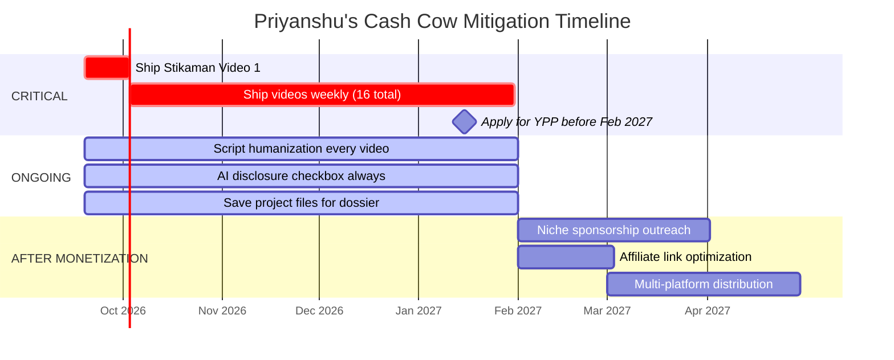

# Cash Cow Channels: Risks & Mitigation (Sept 2026)

> [!IMPORTANT]
> **Bottom line for you, Priyanshu:** Your channels are NOT traditional "cash cows" — they have custom animation (Stikaman) and dramatic storytelling (Nishchay). But you share the same infrastructure (AI scripts, AI voices, zero face) that YouTube is actively targeting. The difference between getting flagged and thriving is **how much human editorial fingerprint** is baked into every video.

---

## What Are "Cash Cow" Channels?

Faceless, automated YouTube channels designed for passive AdSense income. The classic assembly line:

1. AI-generated script (ChatGPT)
2. AI voiceover (ElevenLabs)
3. Stock footage or AI-generated visuals
4. Template editing in CapCut/Premiere
5. Upload at scale, monetize, repeat

**The thesis:** Low cost per video × high upload frequency = passive income portfolio.

**The reality in 2026:** YouTube has systematically dismantled this model.

---

## The 5 Threats That Matter to YOU

### 1. 🚨 Feb 1, 2027 — Monetization Threshold Doubles

| Metric | Current | After Feb 1, 2027 |
|--------|---------|-------------------|
| Watch Hours | 4,000 hrs / 365 days | **8,000 hrs / 365 days** |
| Shorts Views | 10M / 90 days | **20M / 90 days** |
| Subscribers | 1,000 | 1,000 (unchanged) |

> [!CAUTION]
> **Grandfathering clause:** If you're IN YPP before Feb 1, 2027 — you stay in. If you're NOT — you need double the watch hours. You have **~4 months** to hit the old threshold. Every week without a published video is burning this window.

**Your exposure:**
- **Stikaman:** Zero published videos. You need 4,000 watch hours from scratch in ~16 weeks. That's roughly 10-15 solid videos getting decent retention. Extremely tight but possible if you start NOW.
- **Nishchay Stories:** Still in research phase. Will almost certainly face the 8,000-hour threshold.

---

### 2. 🏷️ "Inauthentic Content" Policy (Replaced "Repetitious Content" — July 2025)

YouTube's definition of **Inauthentic Content**:
- Rigid template workflows (same structure, only facts swapped)
- AI generated script + voice + visuals end-to-end without human editorial judgment
- No original analysis or perspective
- Stock footage + generic voiceover = NOT transformative

**The "10-Video Swap Test":** If someone could paste your script/editing/voice onto a competitor channel and no viewer would notice — you're flagged.

**Your exposure:**
- **Stikaman:** Stickman animation is inherently unique visual style — this is your strongest defense. BUT if scripts read like "ChatGPT rewrote Wikipedia," the script layer fails the test.
- **Nishchay Stories:** Hindi dramatic storytelling with 100% competitor-driven approach. If you clone competitors' script structures without injecting your own narrative fingerprint, you're vulnerable.

---

### 3. 🤖 Mandatory AI Disclosure + Detection

- Creators MUST check the "Altered or Synthetic Content" box for realistic AI video, synthetic voices, or AI-altered real events
- YouTube runs multimodal classifiers to DETECT undisclosed AI content
- Repeated non-disclosure = strikes, algorithmic suppression, YPP removal

**Your exposure:**
- Both channels use AI voiceover → must disclose
- AI-generated images/B-roll → must disclose
- This is a checkbox discipline issue, not a dealbreaker — just never skip it

---

### 4. 📉 Algorithm Now Weights "Satisfaction" Over Raw Watch Time

The 2025-2026 algorithm evaluates:
- Post-watch satisfaction surveys (1-5 stars)
- "Not Interested" click rates
- Repeat viewership and session contribution
- **Frame-by-frame AI analysis** of pacing, visual redundancy, and tone

Videos with generic stock loops, repetitive AI pacing, or mismatched B-roll get **suppressed in Suggested and Browse feeds**.

**Your exposure:**
- **Stikaman:** Custom stickman animation avoids "stock footage" flags. But AI-paced scripts with predictable cadence ("But here's the thing...") will get detected.
- **Nishchay Stories:** Hindi entertainment has strong emotional engagement signals IF the storytelling is genuinely dramatic. Template melodrama gets crushed.

---

### 5. 🌊 Niche Saturation & CPM Collapse

Niches getting **destroyed** right now:

| Niche | Status |
|-------|--------|
| Reddit TTS + Minecraft parkour | ☠️ Dead |
| AI Stoic motivation quotes | ☠️ Dead |
| Celebrity net worth listicles | ☠️ Dead |
| AI historical "what ifs" | ⚠️ Dying |
| Trivia/quiz templates | ☠️ Dead |
| 10-hour ambient loops | ☠️ Dead |
| AI emotional melodrama | ⚠️ Dying |

**Your exposure:**
- **Stikaman (dark history + military explainers):** NOT in a dead niche. Educational/documentary faceless channels with genuine depth are thriving. Your niche is safe IF execution quality is high.
- **Nishchay Stories (Hindi drama):** Higher risk. Hindi emotional storytelling is adjacent to "AI emotional melodrama" — your differentiator must be genuine dramatic craft, not formula.

---

## Mitigation: What You Need to Do

### ✅ Things Already Working in Your Favor

| Defense | Stikaman | Nishchay |
|---------|----------|----------|
| Custom animation (not stock footage) | ✅ Strong | ❌ TBD |
| High-RPM niche (Tier 1, dark history) | ✅ Strong | ⚠️ Hindi = lower RPM |
| 10-15 min format (high watch time potential) | ✅ | ✅ (15+ min) |
| AI production tools (cost = \$0) | ✅ | ✅ |

### 🔧 Actions Required — Ranked by Impact

#### 1. SHIP VIDEOS NOW (Non-Negotiable)
- The Feb 2027 deadline is existential for Stikaman
- Even imperfect videos > no videos
- Target: 1 video/week starting immediately = 16 videos before deadline
- **This overrides all other planning**

#### 2. Script Humanization Layer
Every script must pass through human editorial judgment:
- **Don't:** Let AI write → AI voice → upload
- **Do:** AI draft → YOU rewrite hook + transitions + add personal takes → humanize language → THEN voice
- Add counterarguments, surprising facts AI wouldn't generate, contrarian angles
- Your `/humanizer` and `/ai-writing-gaps` skills exist for exactly this

#### 3. Voice Strategy
| Option | Risk Level | Cost |
|--------|-----------|------|
| Your own voice | 🟢 Lowest risk | Free |
| Custom ElevenLabs clone of YOUR voice | 🟡 Low risk (disclose) | Free (you have it) |
| Generic AI TTS voice | 🔴 Highest risk | — |

> [!TIP]
> **Best move for Stikaman:** Clone your own voice in ElevenLabs, then manually review every audio output for robotic artifacts. Always check the AI disclosure box. This gives you speed + authenticity.

#### 4. Visual Fingerprint
- Stikaman's stickman animation is inherently unique — **double down on this**
- Develop 2-3 signature visual elements (recurring character designs, transition styles, color palette) that make your channel instantly recognizable
- Use Remotion/Manim for data visualizations that competitors can't replicate

#### 5. AI Disclosure Discipline
- ALWAYS check "Altered or Synthetic Content" in YouTube Studio
- This is a one-click checkbox — zero cost, prevents strikes
- Make it a non-negotiable upload checklist item

#### 6. Build the "Appeal Dossier" From Day 1
Even high-effort channels get caught in automated sweeps. Save:
- Script drafts with edit history (Google Docs tracked changes)
- Project files (.blend, Remotion code, animation source files)
- Raw voiceover stems
- Research notes and primary sources
- A 3-minute face-on-camera video of you explaining your process (for YPP appeals)

#### 7. Revenue Diversification (After Monetization)
Don't depend 100% on AdSense:
- Niche sponsorships (military history → tactical gear, survival brands)
- Affiliate links in description (books, documentaries, courses)
- Community building (Discord, newsletter)

---

## Priority Matrix: What to Do When

---

## TL;DR

| Question | Answer |
|----------|--------|
| Are cash cow channels dead? | The lazy template model is dead. High-effort faceless channels thrive. |
| Is Stikaman at risk? | **Low risk** — custom animation + educational depth is exactly what survives. But zero published videos = zero defense against threshold doubling. |
| Is Nishchay at risk? | **Medium risk** — Hindi drama is adjacent to "AI melodrama" niche. Needs strong narrative differentiation. |
| What's the #1 thing to do? | **Ship Stikaman Video 1 this week.** Everything else is secondary. |
| What about AI voices? | Clone YOUR voice, always disclose, always review output. |
| Will YouTube ban faceless channels? | No. They're banning *low-effort* faceless channels. Yours has custom animation — that's your moat. |
