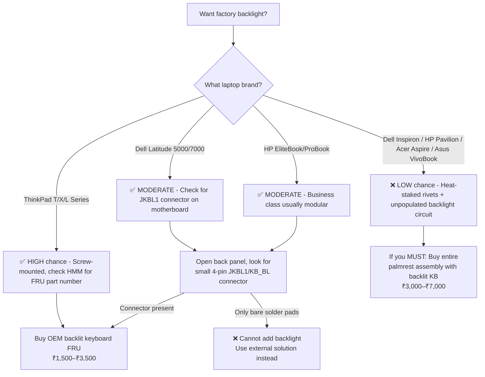

# 💡 Laptop Keyboard Backlight Jugaad Guide

**Research Date:** September 2026 | **Depth:** Thorough (2 parallel agents, 10+ sources cross-validated)

---

## 🏆 TL;DR — Pick Your Fighter

| # | Method | Cost (₹) | Difficulty | Works? | Best For |
|---|--------|----------|------------|--------|----------|
| **1** | ⭐ **USB Gooseneck LED Stick** | ₹30–₹150 | Plug & Play | ✅ Yes | **Ultra-budget, hostel, travel** |
| **2** | ⭐⭐ **Laptop Screenbar Light** | ₹800–₹1,800 | Clip-on | ✅ Best | **Desk setup, pro look** |
| **3** | **USB Clip-on Reading Lamp** | ₹250–₹500 | Clamp | ✅ Yes | Late night typing |
| **4** | **Glow-in-Dark Key Stickers** | ₹150–₹350 | Tedious | ⚠️ Fades | Zero power needed |
| **5** | **External Backlit USB Keyboard** | ₹400–₹899 | Plug & Play | ✅ Yes | Heavy typing, gaming |
| **6** | **Screen White-Strip Hack** | ₹0 FREE | Software | ⚠️ Hack | Emergency, zero spend |
| **7** | **DIY ThinkLight / LED Strip** | ₹80–₹200 | Soldering | ✅ If careful | Electronics hobbyist |
| **8** | **OEM Backlit Keyboard Swap** | ₹1,500–₹3,500 | Disassembly | ✅ If compatible | Factory-clean result |
| **9** | ~~Internal LED Strip Under Keys~~ | ₹150–₹300 | Extreme | ❌ **NO** | **DON'T DO THIS** |
| **10** | ~~Laser Projection Keyboard~~ | ₹1,800–₹4,000 | Easy | ❌ Useless | Novelty only |

---

## 🥇 Method 1: Flexible USB Gooseneck LED Light (The ₹50 Jugaad King)

> [!TIP]
> **This is the #1 recommended jugaad.** Cheapest, safest, zero modification to laptop.

### What Is It?
A flexible silicone-coated bendable stick with 1–6 SMD LEDs. Plug into any USB-A port, bend it over the keyboard.

### Cost & Where to Buy
| Source | Price |
|--------|-------|
| Local electronics shop / street vendor | ₹20–₹50 |
| Amazon.in / Flipkart (single) | ₹49–₹99 |
| Amazon.in / Meesho (pack of 2-3) | ₹99–₹199 |

### Pro Tips (Jugaad Upgrades)
- **Fix the glare problem:** Wrap black electrical tape around the top half of the LED diffuser — forces light *only* downward onto keys
- **Fix uneven lighting:** Buy 2 cheap ones (₹40 total from local shop), plug into both USB ports on opposite sides
- **Power bank trick:** If laptop has only 1 USB port, use a small power bank to power the light separately

### Pros & Cons
| ✅ Pros | ❌ Cons |
|---------|---------|
| Dirt cheap (₹30–₹50 locally) | Light is brighter on one side |
| Zero modification to laptop | Sticks out from USB — can get bumped |
| Ultra-portable (fits in pencil pouch) | Can glare in eyes if not angled right |
| Negligible battery drain (~1.2W) | |

---

## 🥈 Method 2: Laptop Clip-On Monitor Light Bar (Screenbar)

> [!TIP]
> **Best overall experience** if you work at a desk. Uniform, glare-free lighting.

### What Is It?
A 26–33cm LED bar that clips onto your laptop's screen bezel. Uses asymmetric optics to cast light *only* downward — zero screen glare.

### Cost & Where to Buy
| Product | Price |
|---------|-------|
| Generic 13"–15" laptop screenbar (Amazon.in) | ₹800–₹1,200 |
| Techzere / LIVVIOMART brand | ₹1,000–₹1,800 |

### Pros & Cons
| ✅ Pros | ❌ Cons |
|---------|---------|
| Perfect uniform illumination | ₹800+ initial cost |
| Multiple brightness + color temp | Must remove before closing lid |
| Professional, sleek look | May cover webcam (check notch) |
| Eye health friendly (no glare) | Slight weight on screen hinge |

---

## 🥉 Method 3: The Free ₹0 Software Hack

### Three Zero-Cost Tricks

**Hack A — Bottom White Strip:**
1. Open Notepad or browser
2. Set background to pure white
3. Resize window into a narrow strip at the bottom of screen
4. Crank up brightness → light reflects down onto keys

**Hack B — Quick Browser Trick:**
```
Paste this in Chrome/Edge address bar:
data:text/html,<body style="background:white">
```
Instant full-screen white reflector!

**Hack C — High Contrast Mode:**
Press `Left Alt + Left Shift + Print Screen` → toggles Windows High Contrast

> [!WARNING]
> These drain battery fast and cause eye strain. Use only as emergency fix.

---

## 🔧 Method 4: DIY ThinkLight / LED Strip (Pure Jugaad Build)

### What You Need (Total: ₹80–₹200)
| Part | Cost | Where |
|------|------|-------|
| 5V LED strip (10–15 cm) OR single 5mm white LED | ₹40 | Local electronics shop, Robu.in |
| 100Ω resistor (for single LED build) | ₹2–₹5 | Same |
| Old USB cable (cut one end) | ₹20–₹30 | Any junk drawer |
| Double-sided tape / heat shrink | ₹20 | Stationery shop |
| Soldering iron (borrow from friend?) | ₹0–₹150 | - |

### Two Build Options

**Build A — Bezel-Mounted LED Strip:**
1. Cut 10–15 cm of 5V USB LED tape
2. Strip an old USB cable — identify Red (+5V) and Black (GND) wires
3. Solder LED strip pads to USB cable wires
4. Stick strip along the bottom bezel of screen (facing keys)
5. Route cable neatly along hinge

**Build B — DIY ThinkLight (Single LED Hood):**
1. Solder a 5mm white LED + 100Ω resistor to USB cable
2. House LED inside an empty pen cap (acts as glare hood)
3. Tape it to the top display bezel, pointing down
4. Plug USB into laptop

> [!CAUTION]
> **Critical:** Make sure the LED placement does NOT touch the keyboard surface when the lid closes — or it will **crack your screen!** Test with lid partially closed first.

---

## 🔄 Method 5: OEM Backlit Keyboard Swap (The Clean Upgrade)

### Step 1: Check If Your Laptop Supports It



### How to Verify (Before Spending Money!)
1. Open laptop bottom panel
2. Find the keyboard ribbon connector area on motherboard
3. Look for a **secondary small 4-pin FPC latch** labeled `KB_BL`, `JKBL1`, or `BACKLIGHT`
4. **If the ZIF connector socket is physically present** → You can swap!
5. **If only bare solder pads** → Your motherboard doesn't support it. Stop here.

### Cost
| Item | Price |
|------|-------|
| OEM backlit keyboard (Amazon.in, MyLaptopSpares) | ₹1,500–₹3,500 |
| Installation at local shop (Nehru Place / SP Road) | ₹300–₹500 |
| Full palmrest assembly (if riveted laptop) | ₹3,000–₹7,000 |

> [!IMPORTANT]
> **If your laptop has plastic rivets (not screws) holding the keyboard, NEVER buy just the keyboard.** Buy the entire palmrest assembly with the backlit keyboard pre-installed, or the result will be mushy, rattly keys.

---

## ⛔ Methods to AVOID (Don't Waste Your Money)

### ❌ Internal LED Strip Under Keys — NEVER DO THIS

> [!CAUTION]
> This is the most common "jugaad" people think of — and it **destroys laptops**.

**Why it fails completely:**

| Problem | What Happens |
|---------|--------------|
| **Opaque keycaps** | Non-backlit keys are solid black plastic. Light CANNOT shine through the letters. You get blinding side-glare but still can't read the keys! |
| **Sub-mm clearance** | LED strip (1.2–2mm thick) causes keys to stick, bind, and feel spongy |
| **Screen cracking** | Raised keyboard presses against LCD when lid closes |
| **Short circuit** | Exposed copper pads touch grounded chassis → fries motherboard PMIC permanently |
| **Battery danger** | Heat from LEDs trapped in sealed cavity → LiPo battery swelling risk |
| **Always-on drain** | LEDs stay lit even in sleep mode, draining battery overnight |

### ❌ Laser Projection Keyboard — Novelty, Not Practical
- ₹1,800–₹4,000 wasted
- Zero tactile feedback, high error rate
- Requires flat, non-glossy surface
- Finger pain from tapping hard surfaces
- Cannot touch-type

---

## ⚠️ Safety & Warranty Warnings

### Warranty Impact
| Action | Warranty Status |
|--------|----------------|
| USB gooseneck light / screenbar | ✅ **Safe** — no modification |
| Glow-in-dark stickers | ✅ **Safe** — removable |
| External USB keyboard | ✅ **Safe** — plug & play |
| OEM keyboard swap (screws) | ⚠️ **Grey area** — may void if tamper seals broken |
| Internal LED/EL wire mod | ❌ **Void** — classified as Customer Induced Damage |
| Soldering on motherboard | ❌ **Void** — immediate CID classification, ₹25,000+ repair bill |

### USB LED Safety Tips
- **Avoid ultra-cheap thumb-sized USB LEDs** — they can reach 55–70°C and damage your USB port over time
- Use aluminum-bodied gooseneck lights that dissipate heat away from the port
- Use a 6-inch USB extension cable to prevent mechanical strain on the port if bumped

### Battery Drain Reality Check
A USB LED light draws only ~1.2–2.5W. On a typical 50Wh laptop battery:
- **Impact: Only 3–6% reduction** in battery life (~12–20 minutes less)
- Verdict: **Negligible** — don't worry about it

---

## 🎯 My Recommendation (Based on Your Budget)

### Budget: ₹0 (Absolutely Free)
→ Use the **Screen White-Strip Software Hack** (Method 3) tonight as emergency fix

### Budget: ₹50–₹100 (Best Jugaad)
→ Buy a **Flexible USB Gooseneck LED** from your nearest mobile accessories shop tomorrow
- Add black tape on top half to fix glare
- This solves 80% of the problem for ₹50

### Budget: ₹400–₹800
→ Buy a **budget backlit USB keyboard** (Zebronics Zeb-Transformer, ₹400–₹600 on Amazon)
- True backlit keys + better typing feel
- Perfect if you mainly use laptop at desk

### Budget: ₹800–₹1,500
→ Buy a **Laptop Screenbar** (₹800–₹1,200 on Amazon)
- The premium jugaad — looks pro, uniform lighting, zero glare

### Budget: ₹2,000+ (Permanent Fix)
→ Check if your laptop supports **OEM backlit keyboard swap** (Method 5)
- Verify `JKBL1` connector first!
- Visit Nehru Place (Delhi), SP Road (Bangalore), Lamington Road (Mumbai), or Ritchie Street (Chennai)

---

## 📚 Sources

| Source | Tier | Used For |
|--------|------|----------|
| Dell Support Community | A | OEM swap feasibility, JKBL1 connector info |
| HP Support Knowledge Base | A | Warranty policies, hardware manuals |
| Lenovo HMM (Hardware Maintenance Manuals) | A | ThinkPad keyboard FRU numbers |
| Amazon.in / Flipkart product listings | A | Pricing, product specs |
| Hackaday keyboard mod projects | B | DIY LED strip techniques & failures |
| Reddit r/thinkpad, r/techsupport, r/laptoprepair | B-C | Real-world user experiences |
| Instructables laptop modification guides | B-C | Internal mod attempts & outcomes |
| Nerd Techy USB LED reviews | B | Thermal testing of USB lights |

---

> **Provenance:** Research conducted September 4, 2026. 2 parallel research agents. 15+ sources consulted across official documentation, e-commerce platforms, hardware forums, and DIY communities. Counter-evidence searched for internal mods — confirmed high failure rate across multiple independent sources.
