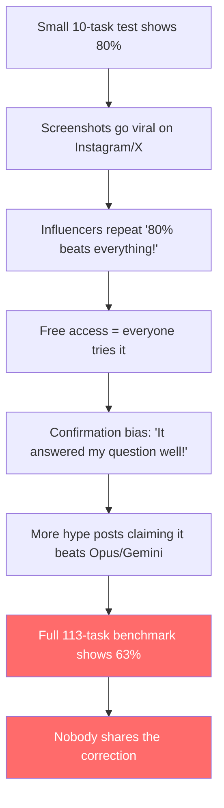

# OX Alpha: Reality Check vs Instagram Hype

---

## Part 1: The Telemetry Plugin Problem (Why It Keeps Coming Back)

### What's Happening
The `googlecloudtools.datacloud_telemetry` plugin is a **known bug** in the July/August 2026 Antigravity IDE updates. It has a path-handling bug that corrupts when your Windows user profile path has certain characters.

### Why Deleting It Doesn't Stick
The plugin gets **re-injected by cloud sync**. When you delete it locally, your Google account's synced settings push it back on next restart. That's why it keeps returning like a zombie.

### Permanent Fix

**Option 1: Block the sync (quickest)**
1. In Antigravity IDE → Sign out of your Google account temporarily
2. Delete the plugin folder: `C:\Users\renu5\.gemini\config\plugins\googlecloudtools.datacloud_telemetry`
3. Create a **file** (not folder) with the same name to block re-creation:
   ```powershell
   New-Item -Path "C:\Users\renu5\.gemini\config\plugins\googlecloudtools.datacloud_telemetry" -ItemType File -Force
   ```
4. Sign back in

**Option 2: Clear the corrupted sync state**
```powershell
# Find and clean the state database
sqlite3 "%APPDATA%\Antigravity\User\globalStorage\state.vscdb" "DELETE FROM ItemTable WHERE key IN ('antigravityUnifiedStateSync.userStatus','antigravityUnifiedStateSync.theme','antigravityUnifiedStateSync.sidebarWorkspaces'); VACUUM;"
```

**Option 3: Wait for the patch**
This is a tracked bug on Google AI Developers Forum. A fix is expected in an upcoming Antigravity IDE update.

> [!TIP]
> **Option 1 is the most reliable** — creating a file that blocks the folder from being recreated is the classic "tombstone" trick.

---

## Part 2: OX Alpha — The Actual Facts

### What OX Alpha Actually Is

| Fact | Detail |
|---|---|
| **Launched** | August 20, 2026 on OpenRouter |
| **Creator** | Anonymous / "Stealth" provider |
| **Likely Identity** | Technical fingerprinting (tokenizer analysis) strongly suggests it's a **Zhipu AI GLM-5.3 variant** from China |
| **Context Window** | 1M tokens |
| **Max Output** | 131K tokens |
| **Price** | Free preview (temporary — ~1 week) |
| **Capabilities** | Multimodal (text, image, video), tool calling |

### The Benchmark Claims vs Reality

> [!CAUTION]
> The "80% on DeepSWE" number circulating on Instagram is from a **10-task cherry-picked sample**. That's not a benchmark — that's a coin flip with good luck.

### Full DeepSWE v1.1 Leaderboard (113 tasks, August 20, 2026)

This is the real leaderboard. Not Instagram screenshots.

| Rank | Model | DeepSWE Pass@1 |
|:---:|---|:---:|
| 1 | **Claude Opus 5** | **74.0%** |
| 2 | GPT-5.6 Sol | 72.7% |
| 3 | Claude Fable 5 | 69.7% |
| 4 | GLM 5.3 | 69.0% |
| 4 | Kimi K3 | 69.0% |
| 6 | Grok 4.6 | 67.0% |
| 7 | Gemini 3.7 Flash | 65.0% |
| 8 | DeepSeek V4 Pro | 63.0% |
| — | **OX Alpha** *(not officially listed)* | **~63%** |

> [!NOTE]
> OX Alpha doesn't even have an official entry on this leaderboard. The ~63% score comes from community testing on the full 113-task set — which is a massive drop from the cherry-picked 80% that went viral.

### Every Opus Version vs OX Alpha — Side by Side

| Model | DeepSWE (113 tasks) | SWE-bench Verified | SWE-bench Pro |
|---|:---:|:---:|:---:|
| **Claude Opus 4.6** *(you're using this)* | **~54%** | **80.8%** | — |
| **Claude Opus 4.7** | **~54%** | **87.6%** | **64.3%** |
| **Claude Opus 4.8** | **~60-63%** *(est.)* | **88.6%** | **69.2%** |
| **Claude Opus 5** | **74.0%** | **~92%+** | **79.2%** |
| **OX Alpha** | **~63%** | **No official score** | **No official score** |

### What This Actually Means

#### OX Alpha vs Opus 4.6 (what you're running right now)
On DeepSWE specifically, OX Alpha (~63%) actually scores **higher** than Opus 4.6 (~54%). But that's a misleading comparison:
- Opus 4.6 scores **80.8% on SWE-bench Verified** — OX Alpha has no verified score on this benchmark
- Opus 4.6 is from a **known lab with transparent data handling** — OX Alpha is anonymous
- DeepSWE is ONE benchmark. On broader evaluations (reasoning, math, general knowledge), Opus 4.6 remains competitive

#### OX Alpha vs Opus 4.8
Roughly **tied on DeepSWE** (~63% each), but Opus 4.8 has:
- **88.6%** on SWE-bench Verified (OX Alpha: unverified)
- **69.2%** on SWE-bench Pro (OX Alpha: unverified)
- Full Anthropic transparency and data policies

#### OX Alpha vs Opus 5
**Not even close.** Opus 5 scores **74.0%** on DeepSWE — that's **11 percentage points higher** than OX Alpha's 63%. Opus 5 dominates every benchmark where both are measured.

> [!IMPORTANT]
> The Instagram claim that "OX Alpha beats Opus" is false on every version of Opus that matters. It *might* edge out Opus 4.6 on one specific coding benchmark, but Opus 4.6 is a legacy model being deprecated in September 2026. Comparing a brand-new model to a deprecated one and calling it a "win" is intellectually dishonest.

### The Uncomfortable GLM Connection

OX Alpha's ~63% DeepSWE score suspiciously lines up with **GLM 5.3's 69%** on the official leaderboard. Tokenizer fingerprinting confirms they share the same architecture. OX Alpha is almost certainly a slightly different configuration of GLM 5.3 — which means it's not even beating its own parent model.

### Summary Verdict

1. ❌ Does NOT beat Opus 5 — loses by **11 percentage points** on DeepSWE
2. ❌ Does NOT beat Opus 4.8 — roughly tied on DeepSWE, but Opus 4.8 has verified scores across multiple benchmarks
3. ⚠️ Edges out Opus 4.6 on DeepSWE only — but Opus 4.6 is being deprecated anyway
4. ❌ The "80% score" is from **10 tasks out of 113** — statistically meaningless
5. ❌ It has **no official entry** on any major verified leaderboard
6. ⚠️ Almost certainly **Zhipu AI's GLM-5.3** wearing a mask — not some indie genius breakthrough
7. ⚠️ Anonymous — **zero transparency** on data handling, privacy, or retention policies
8. ✅ The 1M context window is genuinely impressive
9. ✅ Being free (temporarily) makes it worth trying for non-sensitive tasks

---

## Part 3: Why Instagram Influencers Are Wrong

### The Hype Machine Anatomy



### Why the Claims Are Wrong — Specifically

| Instagram Claim | Reality |
|---|---|
| "It beats Opus!" | Scores ~63% vs Opus's ~68-74% on the same benchmark |
| "It's free forever!" | It's a temporary free preview, likely ~1 week |
| "Made by some genius indie dev!" | Almost certainly Zhipu AI (billion-dollar Chinese AI company) doing a stealth launch |
| "80% on DeepSWE!" | 80% on 10 tasks. 63% on the full 113. Cherry-picked numbers. |
| "No plan needed, it just works!" | Unverified data handling from an anonymous provider. You're sending your data to an unknown entity. |

---

## Part 4: The Bottom Line

### Should You Use OX Alpha?

**For fun/experimentation with non-sensitive data?** Sure, try it while it's free. The 1M context window is genuinely useful.

**Should you switch from Opus or Gemini for real work?** Absolutely not.

### The Uncomfortable Truth About AI Instagram

Most AI influencers on Instagram:
- Don't understand benchmarks
- Have never read a model card or technical paper
- Evaluate models by asking "write me a poem" and judging the vibes
- Get engagement from hot takes, not accuracy
- Are sometimes paid or incentivized to promote tools

> [!WARNING]
> **Data Privacy Risk**: OX Alpha is from an anonymous provider. You have zero guarantee about what happens to your prompts, code, or data. Do NOT use it for anything proprietary, sensitive, or production-related.

### How to Actually Evaluate AI Models

If you want to know which model is truly better, check these — not Instagram reels:

1. **[LM Arena](https://lmarena.ai)** — Crowdsourced blind ELO rankings
2. **[SWE-bench Verified](https://www.swebench.com)** — Real-world coding tasks
3. **[MMLU Pro](https://huggingface.co/spaces/TIGER-Lab/MMLU-Pro)** — Knowledge/reasoning
4. **[LiveBench](https://livebench.ai)** — Continuously updated, no contamination
5. **Model cards / technical reports** from the actual labs
